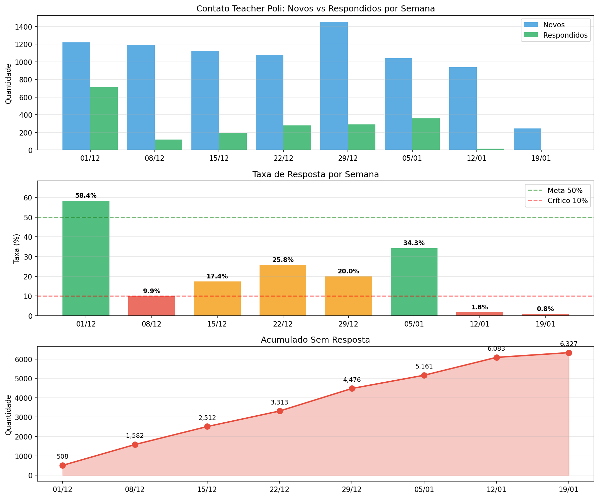
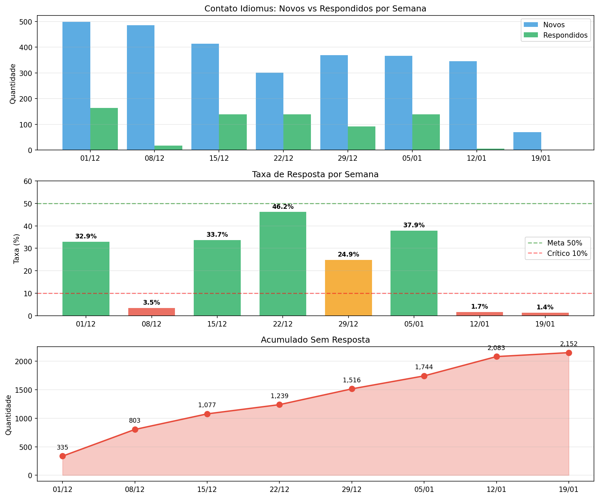
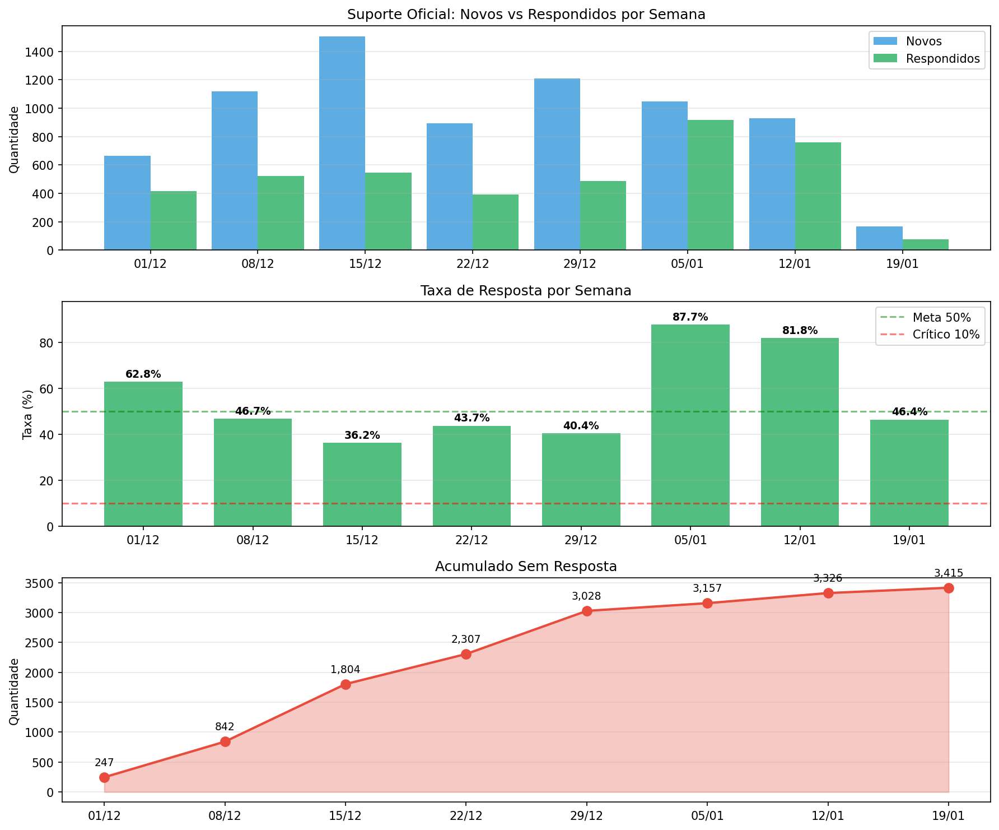
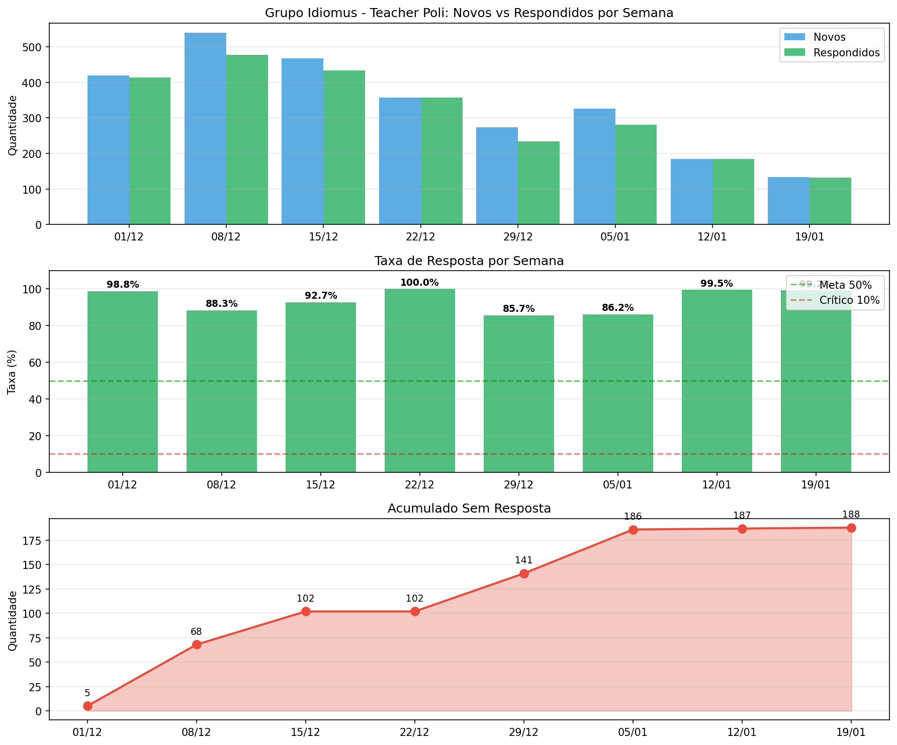

# Relatório: Análise de Conversas - Email e WhatsApp

**Data:** 20/01/2026
**Autor:** Análise automatizada

---

## Resumo Executivo

Análise das conversas nos canais de atendimento: Email (Contato Idiomus e Contato Teacher Poli) e WhatsApp (Suporte Oficial e Grupo Idiomus). Os inboxes de Email apresentam taxas de conversas abertas significativamente maiores (8.4% e 30.0%) e menores taxas de resposta (43.2% e 47.9%) comparados ao WhatsApp (72-77% de resposta).

---

## 1. Visão Geral

### 1.1 Composição dos Dados

Os dados incluem conversas de duas origens:

| Origem | Email | WhatsApp | Total |
|--------|-------|----------|-------|
| Migradas da Evolvy | 26.741 | 52.254 | 78.995 |
| Nativas (pós 19/12/2025) | 5.232 | 5.787 | 11.019 |
| **Total** | **31.973** | **58.041** | **90.014** |

### 1.2 Situação por Inbox

| Inbox | Canal | Total | Abertas | Pendentes | Resolvidas | % Abertas | % Resposta |
|-------|-------|-------|---------|-----------|------------|-----------|------------|
| Grupo Idiomus - Teacher Poli | WhatsApp | 39.697 | 75 | 1.108 | 10.401 | 0.2% | 77.4% |
| Suporte Oficial | WhatsApp | 18.345 | 182 | 1.009 | 1.513 | 1.0% | 72.1% |
| Contato Idiomus | Email | 16.728 | 1.406 | 2 | 9.709 | **8.4%** | **43.2%** |
| Contato Teacher Poli | Email | 15.245 | 4.572 | 0 | 4.057 | **30.0%** | **47.9%** |

### 1.3 Comparativo Email vs WhatsApp

| Métrica | Email | WhatsApp |
|---------|-------|----------|
| Total de conversas | 31.973 | 58.042 |
| Conversas abertas | 5.978 (18.7%) | 257 (0.4%) |
| Conversas pendentes | 2 (0.0%) | 2.117 (3.6%) |
| Taxa de resposta | 45.5% | 77.2% |
| Com equipe atribuída | 5.6% | 47.8% |
| Com agente atribuído | 5.1% | 75.4% |

---

## 2. Canal de Email

### 2.1 Contato Teacher Poli



| Métrica | Migradas | Nativas | Total |
|---------|----------|---------|-------|
| Total | 11.583 | 3.662 | 15.245 |
| Abertas | 2.476 (21.4%) | 2.096 (57.2%) | 4.572 (30.0%) |
| Com Resposta | 6.310 (54.5%) | 986 (26.9%) | 7.296 (47.9%) |
| Com Equipe | 238 (2.1%) | 852 (23.3%) | 1.090 (7.2%) |
| Com Agente | 0 (0.0%) | 1.147 (31.3%) | 1.147 (7.5%) |

**Observações:**
- Conversas nativas (IMAP) têm 57.2% abertas vs 21.4% das migradas
- Taxa de resposta das nativas (26.9%) é menor que das migradas (54.5%)
- Baixa atribuição de equipe/agente

### 2.2 Contato Idiomus



| Métrica | Migradas | Nativas | Total |
|---------|----------|---------|-------|
| Total | 15.158 | 1.570 | 16.728 |
| Abertas | 781 (5.2%) | 625 (39.8%) | 1.406 (8.4%) |
| Com Resposta | 6.781 (44.7%) | 443 (28.2%) | 7.224 (43.2%) |
| Com Equipe | 366 (2.4%) | 341 (21.7%) | 707 (4.2%) |
| Com Agente | 0 (0.0%) | 485 (30.9%) | 485 (2.9%) |

**Observações:**
- Padrão similar ao Contato Teacher Poli
- Conversas nativas têm taxa de abertas 8x maior (39.8% vs 5.2%)

---

## 3. Canal de WhatsApp

### 3.1 Suporte Oficial



| Métrica | Migradas | Nativas | Total |
|---------|----------|---------|-------|
| Total | 14.012 | 4.333 | 18.345 |
| Abertas | 12 (0.1%) | 170 (3.9%) | 182 (1.0%) |
| Pendentes | 1.009 (7.2%) | 0 (0.0%) | 1.009 (5.5%) |
| Com Resposta | 10.367 (74.0%) | 2.857 (65.9%) | 13.224 (72.1%) |
| Com Equipe | 10.677 (76.2%) | 3.168 (73.1%) | 13.845 (75.5%) |
| Com Agente | 12.006 (85.7%) | 3.490 (80.5%) | 15.496 (84.5%) |

**Observações:**
- Alta taxa de atribuição de equipe (75.5%) e agente (84.5%)
- 1.009 conversas pendentes são todas migradas (out-dez 2025)
- Operação estável com boa taxa de resposta

### 3.2 Grupo Idiomus - Teacher Poli



| Métrica | Migradas | Nativas | Total |
|---------|----------|---------|-------|
| Total | 38.242 | 1.455 | 39.697 |
| Abertas | 11 (0.0%) | 64 (4.4%) | 75 (0.2%) |
| Pendentes | 1.106 (2.9%) | 2 (0.1%) | 1.108 (2.8%) |
| Com Resposta | 29.371 (76.8%) | 1.342 (92.2%) | 30.713 (77.4%) |

**Observações:**
- 1.108 conversas pendentes são migradas de jun-out 2024
- Alta taxa de resposta (77.4%)

---

## 4. Configuração de Automação

### 4.1 Situação no Chatwoot

A automação "Automação CS" atribui equipe para os seguintes inboxes:

| Inbox | Canal | Automação Ativa |
|-------|-------|-----------------|
| Suporte Oficial | WhatsApp | Sim |
| Grupo Idiomus - Teacher Poli | WhatsApp | Sim |
| Contato Idiomus | Email | Não |
| Contato Teacher Poli | Email | Não |

### 4.2 Histórico na Evolvy

A configuração de automação era a mesma antes da migração em 19/12/2025:
- Inboxes de WhatsApp tinham automação de atribuição
- Inboxes de Email não tinham automação de atribuição

---

## 5. Evolução Temporal

### 5.1 Evolução Semanal - Email

| Semana | Contato Idiomus | | Contato Teacher Poli | |
|--------|-----------------|---|---------------------|---|
| | Criadas | % Abertas | Criadas | % Abertas |
| 01/12 | 499 | 67.1% | 1.222 | 41.6% |
| 08/12 | 485 | 96.5% | 1.192 | 90.1% |
| 15/12 | 413 | 66.3% | 1.126 | 82.6% |
| 22/12 | 301 | 53.8% | 1.080 | 74.2% |
| 29/12 | 369 | 75.1% | 1.454 | 80.0% |
| 05/01 | 367 | 62.1% | 1.043 | 65.7% |
| 12/01 | 345 | 98.3% | 939 | 98.2% |
| 19/01* | 70 | 98.6% | 246 | 99.2% |

*Semana incompleta (dados até 20/01/2026)

### 5.2 Evolução Semanal - WhatsApp

| Semana | Suporte Oficial | | Grupo Idiomus | |
|--------|-----------------|---|---------------|---|
| | Criadas | % Resposta | Criadas | % Resposta |
| 01/12 | 664 | 62.8% | 419 | 98.8% |
| 08/12 | 1.117 | 46.7% | 540 | 88.3% |
| 15/12 | 1.507 | 36.2% | 467 | 92.7% |
| 22/12 | 894 | 43.7% | 357 | 100.0% |
| 29/12 | 1.210 | 40.4% | 273 | 85.7% |
| 05/01 | 1.046 | 87.7% | 326 | 86.2% |
| 12/01 | 928 | 81.8% | 185 | 99.5% |
| 19/01* | 166 | 46.4% | 133 | 99.2% |

*Semana incompleta

### 5.3 Observações Temporais

**Email:**
- Taxa de conversas abertas consistentemente alta (60-99%)
- Picos em 08/12 e 12/01 (>96% abertas)
- Sem automação de atribuição configurada

**WhatsApp:**
- Suporte Oficial: Taxa de resposta variável (36-88%)
- Grupo Idiomus: Taxa de resposta consistentemente alta (85-100%)

---

## 6. Detalhamento das Conversas Não Fechadas

### 6.1 Conversas Abertas

| Inbox | Canal | Origem | Quantidade | Período de Criação |
|-------|-------|--------|------------|-------------------|
| Contato Teacher Poli | Email | Migrada | 2.476 | Nov/2025 - Jan/2026 |
| Contato Teacher Poli | Email | Nativa | 2.096 | Dez/2025 - Jan/2026 |
| Contato Idiomus | Email | Migrada | 781 | Mai/2025 - Jan/2026 |
| Contato Idiomus | Email | Nativa | 625 | Dez/2025 - Jan/2026 |
| Suporte Oficial | WhatsApp | Nativa | 170 | Dez/2025 - Jan/2026 |
| Grupo Idiomus | WhatsApp | Nativa | 64 | Dez/2025 - Jan/2026 |

### 6.2 Conversas Pendentes

| Inbox | Canal | Quantidade | Período de Criação |
|-------|-------|------------|-------------------|
| Grupo Idiomus - Teacher Poli | WhatsApp | 1.108 | Jun/2024 - Out/2024 |
| Suporte Oficial | WhatsApp | 1.009 | Out/2025 - Dez/2025 |

#### Detalhamento: Suporte Oficial (1.009 pendentes)

Essas conversas foram migradas da Evolvy com status "pending" original:

| Mês | Pendentes | Com Resposta | Com Agente | Com Equipe |
|-----|-----------|--------------|------------|------------|
| Out/2025 | 166 | 1 (0.6%) | 166 (100%) | 166 (100%) |
| Nov/2025 | 515 | 0 (0%) | 515 (100%) | 515 (100%) |
| Dez/2025 | 328 | 0 (0%) | 326 (99%) | 327 (99%) |

**Observações:**
- Todas tinham agente e equipe atribuídos na Evolvy
- Apenas 1 de 1.009 (0.1%) recebeu resposta
- Indica padrão operacional onde conversas eram marcadas como "pending" sem resolução

#### Detalhamento: Grupo Idiomus (1.108 pendentes)

| Mês | Pendentes | Com Resposta | Com Agente | Com Equipe |
|-----|-----------|--------------|------------|------------|
| Jun/2024 | 241 | 241 (100%) | 0 (0%) | 0 (0%) |
| Jul/2024 | 288 | 288 (100%) | 0 (0%) | 0 (0%) |
| Ago/2024 | 163 | 163 (100%) | 0 (0%) | 0 (0%) |
| Set/2024 | 312 | 312 (100%) | 0 (0%) | 0 (0%) |
| Out/2024 | 99 | 99 (100%) | 0 (0%) | 0 (0%) |
| Recentes | 5 | 4 (80%) | 5 (100%) | 4 (80%) |

**Observações:**
- Conversas de 2024 (1.103): todas respondidas, mas sem atribuição de agente/equipe
- Padrão diferente do Suporte Oficial
- Possivelmente conversas antigas respondidas mas não fechadas

---

## 7. Recomendações

### 7.1 Inboxes de Email

**Criar automação para emails:**
```sql
INSERT INTO automation_rules (
  account_id, name, description, event_name,
  conditions, actions, active, created_at, updated_at
) VALUES (
  1,
  'Automação CS Email',
  'Atribui equipe CS para conversas de email',
  'conversation_created',
  '[{"values": [12, 13], "attribute_key": "inbox_id", "filter_operator": "equal_to"}]',
  '[{"action_name": "assign_team", "action_params": [1]}]',
  true,
  NOW(),
  NOW()
);
```

**Atribuir equipe às conversas abertas existentes:**
```sql
UPDATE conversations
SET team_id = 1
WHERE inbox_id IN (12, 13)
  AND status = 0
  AND team_id IS NULL;
```

### 7.2 Conversas Pendentes (WhatsApp)

**Grupo Idiomus (1.108 → 5 pendentes):**
- ~~Conversas de jun-out 2024~~
- ✅ **Resolvido em 20/01/2026**: 1.103 conversas antigas alteradas para "resolved"
- Log: `docs/log_conversas_pending_para_resolved_20260120.csv`

**Suporte Oficial (1.009 pendentes):**
- Conversas de out-dez 2025
- Verificar se requerem acompanhamento

---

## 8. Verificação de Integridade da Migração

### 8.1 Comparativo com Backup Evolvy (06/01/2026)

Foi realizada verificação cruzada entre as conversas abertas/pendentes no Chatwoot e seus status originais no backup da Evolvy (coletado via API em 06/01/2026).

| Métrica | Valor |
|---------|-------|
| Conversas abertas/pendentes migradas | 5.396 |
| Encontradas no backup | 3.300 |
| Não encontradas no backup | 2.096 |

### 8.2 Preservação de Status

Das 3.300 conversas encontradas no backup, **99%+ mantiveram o status original**:

| Inbox | Status Chatwoot | Status Evolvy | Quantidade | % |
|-------|-----------------|---------------|------------|---|
| Suporte Oficial | pending | pending | 1.008 | 98.7% |
| Suporte Oficial | open | open | 6 | 0.6% |
| Suporte Oficial | open/pending | snoozed | 7 | 0.7% |
| Contato Idiomus | open | open | 268 | 99.3% |
| Contato Teacher Poli | open | open | 2.008 | 100% |
| Grupo Idiomus | open | snoozed | 1 | 100% |

**Conclusão:** A migração preservou corretamente os status das conversas.

### 8.3 Conversas Não Encontradas no Backup

| Inbox | Quantidade | Período IDs | Motivo Provável |
|-------|------------|-------------|-----------------|
| Grupo Idiomus | 1.116 | 94527-250510 | Conversas de jun-out 2024 (anteriores ao backup) |
| Contato Idiomus | 513 | 245326-252354 | Criadas após 06/01/2026 |
| Contato Teacher Poli | 467 | 245437-252346 | Criadas após 06/01/2026 |

### 8.4 Conversas Snoozed

8 conversas que estavam com status "snoozed" na Evolvy foram migradas como abertas/pendentes:

| Evolvy ID | Inbox | Status Chatwoot |
|-----------|-------|-----------------|
| 225156 | Suporte Oficial | pending |
| 226957, 231060, 243719, 246039, 246774, 250114 | Suporte Oficial | open |
| 173342 | Grupo Idiomus | open |

**Nota:** O Chatwoot suporta status "snoozed", mas a migração não preservou esse status.

---

## 9. Métricas de Acompanhamento

| Inbox | Canal | Meta Abertas | Atual | Meta Resposta | Atual |
|-------|-------|--------------|-------|---------------|-------|
| Contato Teacher Poli | Email | <5% | 30.0% | >70% | 47.9% |
| Contato Idiomus | Email | <5% | 8.4% | >70% | 43.2% |
| Suporte Oficial | WhatsApp | <5% | 1.0% | >70% | 72.1% |
| Grupo Idiomus | WhatsApp | <5% | 0.2% | >70% | 77.4% |

---

## 10. Conclusão

A análise identifica padrões distintos entre os canais de atendimento:

1. **Email (Contato Teacher Poli e Contato Idiomus)** apresenta as maiores taxas de conversas abertas (30% e 8.4%) e menores taxas de resposta (47.9% e 43.2%). Não possuem automação para atribuição de equipe, configuração que existia na Evolvy antes de 19/12/2025.

2. **WhatsApp (Suporte Oficial e Grupo Idiomus)** mantém operação estável com alta taxa de atribuição (75-84%) e resposta (72-77%). As conversas pendentes (2.117 total) são de migração e requerem avaliação.

---

## Nota sobre Outros Canais

Este relatório não inclui os canais de Facebook (Idiomus, Teacher Poli, Teacher Poli Latam) que recebem comentários em posts via API Meta. Esses canais têm baixa taxa de resposta por design, pois nem todos os comentários requerem resposta individual.

---

*Relatório gerado em 20/01/2026*
