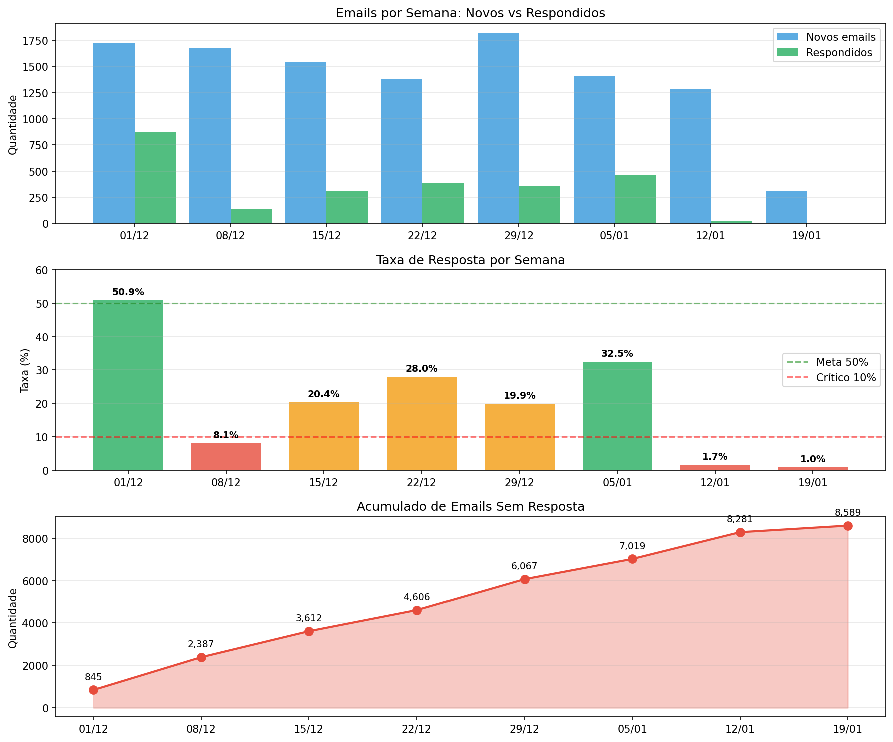

# Relatório: Análise de Emails Não Atendidos

**Data:** 20/01/2026
**Autor:** Análise automatizada

---

## Resumo Executivo

Foram identificadas **5.732 conversas de email abertas sem resposta** nas caixas de email do Chatwoot. A análise indica que os inboxes de email não possuem automação para atribuição de equipe, um padrão que já existia na plataforma Evolvy antes da migração em 19/12/2025.

---

## 1. Visão Geral

### 1.1 Composição dos Dados

Os dados analisados incluem conversas de duas origens:

| Origem | Quantidade | % |
|--------|------------|---|
| Migradas da Evolvy | 26.741 | 84% |
| Via IMAP (pós 19/12/2025) | 5.229 | 16% |
| **Total** | **31.970** | 100% |

### 1.2 Situação Atual

| Métrica | Valor | % do Total |
|---------|-------|------------|
| Total de conversas de email | 31.970 | 100% |
| Conversas abertas | 5.973 | 18.7% |
| **Abertas SEM resposta** | **5.732** | **17.9%** |
| Abertas SEM agente atribuído | 5.247 | 16.4% |
| Abertas SEM equipe atribuída | 5.851 | 18.3% |

### 1.3 Distribuição por Inbox

| Inbox | Abertas sem resposta | % do inbox |
|-------|---------------------|------------|
| Contato Teacher Poli | 4.496 | 29.5% |
| Contato Idiomus | 1.236 | 7.4% |

### 1.4 Comparativo com Outros Canais

| Canal | Abertas sem resposta | % |
|-------|---------------------|---|
| **Email** (Teacher Poli) | 3.514 | **66.7%** |
| **Email** (Idiomus) | 629 | **39.2%** |
| WhatsApp | 68 | 1.4% |
| API (outros) | ~100 | 0.1-2% |

**Observação:** A taxa de conversas abertas sem resposta é significativamente maior no canal de email comparado aos demais canais.

---

## 2. Configuração de Automação

### 2.1 Situação no Chatwoot

A automação "Automação CS" no Chatwoot atribui equipe para os seguintes inboxes:
```
Inboxes com automação: 10 (Suporte Oficial), 11 (Grupo Idiomus)
Inboxes sem automação: 12 (Contato Idiomus), 13 (Contato Teacher Poli)
```

### 2.2 Histórico na Evolvy

Verificação no dump da Evolvy (backup de 06/01/2026) indica que a regra "Automação CS" (ID 9408) não incluía os inboxes de email:
- 14483 (API Oficial) - incluído
- 13984 (Teacher Poli WhatsApp) - incluído
- 13726 (Teacher Poli Oficial) - incluído
- 14448 (Email Suporte) - não incluído
- 14453 (Email Teacher Poli) - não incluído

Este padrão de configuração existia na Evolvy antes de 19/12/2025 (data da migração) e foi mantido no Chatwoot.

### 2.3 Fluxo Atual

```
Email chega via IMAP
       ↓
Conversa criada como "aberta"
       ↓
Sem automação de atribuição configurada
       ↓
Conversa não aparece na fila da equipe
       ↓
Cliente entra em contato por WhatsApp
       ↓
WhatsApp tem automação → atendido
       ↓
Email original permanece aberto
```

---

## 3. Detalhamento das Conversas

### 3.1 Antiguidade dos Emails Não Respondidos

| Período | Contato Idiomus | Contato Teacher Poli | Total |
|---------|-----------------|---------------------|-------|
| Últimos 7 dias | 294 | 980 | 1.274 |
| 8-14 dias | 204 | 542 | 746 |
| 15-30 dias | 106 | 1.760 | 1.866 |
| **Mais de 30 dias** | **665** | **1.181** | **1.846** |

### 3.2 Categorização por Urgência

| Categoria | Total | % | Prioridade |
|-----------|-------|---|------------|
| SEM ASSUNTO | 3.213 | 56.1% | Avaliar |
| **CANCELAMENTO** | **1.239** | **21.6%** | 🔴 CRÍTICO |
| OUTROS | 660 | 11.5% | Avaliar |
| RESPOSTAS (Re:) | 347 | 6.1% | Médio |
| SISTEMA (auto-resolver) | 112 | 2.0% | Baixo |
| **FINANCEIRO** | **89** | **1.6%** | 🔴 CRÍTICO |
| **RECLAMAÇÃO** | **72** | **1.3%** | 🔴 CRÍTICO |

### 3.3 Casos de Clientes Insistentes

Existem clientes que enviaram **múltiplas mensagens** sem obter resposta:

| Conversa | Assunto | Msgs | Período |
|----------|---------|------|---------|
| 240944 | Cancelo suscripcion VITALICIO | 10 | 10/01-20/01 |
| 248064 | Cancelamento de curso | 7 | 15/01-19/01 |
| 242369 | REEMBOLSO - Garantia 30 dias | 7 | 12/01-18/01 |

**Exemplo real** (conversa 240944):
> "SON 10 DIAS SEGUIDOS INSISTIENDO"
> "Ya se pusieron en contacto conmigo por el chat"
> "Entiendo que ya saben de mi pedido según varias conversaciones por el WhatsApp"

O cliente foi posteriormente atendido pelo WhatsApp, enquanto a conversa de email permaneceu aberta.

### 3.4 Atendimento Cross-Channel

- **149 emails abertos** pertencem a contatos que **já foram atendidos** por outro canal
- **95 contatos** afetados por essa situação

---

## 4. Recomendações

### 4.1 Ação Imediata (Hoje)

**Criar automação para emails:**
```sql
INSERT INTO automation_rules (
  account_id, name, description, event_name,
  conditions, actions, active, created_at, updated_at
) VALUES (
  1,
  'Automação CS Email',
  'Atribui equipe CS para conversas de email',
  'conversation_created',
  '[{"values": [12, 13], "attribute_key": "inbox_id", "filter_operator": "equal_to"}]',
  '[{"action_name": "assign_team", "action_params": [1]}]',
  true,
  NOW(),
  NOW()
);
```

### 4.2 Ação de Curto Prazo (Esta Semana)

1. **Atribuir equipe CS** às 5.851 conversas abertas sem equipe:
```sql
UPDATE conversations
SET team_id = 1
WHERE inbox_id IN (12, 13)
  AND status = 0
  AND team_id IS NULL;
```

2. **Priorizar emails críticos:**
   - 1.239 cancelamentos
   - 89 financeiros
   - 72 reclamações

3. **Auto-resolver emails de sistema:**
```sql
UPDATE conversations
SET status = 1
WHERE inbox_id IN (12, 13)
  AND status = 0
  AND (
    additional_attributes->>'mail_subject' ILIKE '%dmarc%'
    OR additional_attributes->>'mail_subject' ILIKE '%report domain%'
    OR additional_attributes->>'mail_subject' ILIKE '%undelivered%'
  );
```

### 4.3 Ação de Médio Prazo

1. **Treinar equipe** para:
   - Monitorar caixa de email
   - Fechar email quando resolver por outro canal

2. **Criar automação** para detectar quando contato é atendido em outro canal e notificar sobre email pendente

3. **Dashboard de monitoramento** de emails não respondidos

---

## 5. Métricas de Acompanhamento

Após implementar as correções, monitorar:

| Métrica | Meta | Atual |
|---------|------|-------|
| Emails abertos sem atribuição | 0 | 5.247 |
| Emails abertos há +7 dias sem resposta | <50 | 4.458 |
| Taxa de resposta em emails | >80% | ~4% |

---

## 6. Conclusão

A análise identificou 5.732 conversas de email abertas sem resposta. Os inboxes de email não possuem automação para atribuição de equipe, configuração que já existia na plataforma Evolvy antes da migração em 19/12/2025 e foi mantida no Chatwoot.

---

## 7. Análise Temporal

### 7.1 Evolução Semanal



| Semana | Novos | Respondidos | Sem resposta | Taxa resposta | Acumulado |
|--------|-------|-------------|--------------|---------------|-----------|
| 01/12 | 1.721 | 876 | 845 | **50.9%** ✅ | 845 |
| 08/12 | 1.677 | 135 | 1.542 | **8.1%** 🔴 | 2.387 |
| 15/12 | 1.539 | 314 | 1.225 | 20.4% | 3.612 |
| 22/12 | 1.381 | 387 | 994 | 28.0% | 4.606 |
| 29/12 | 1.823 | 362 | 1.461 | 19.9% | 6.067 |
| 05/01 | 1.410 | 458 | 952 | 32.5% | 7.019 |
| 12/01 | 1.284 | 22 | 1.262 | **1.7%** 🔴 | 8.281 |
| 19/01 | 311 | 3 | 308 | **1.0%** 🔴 | 8.589 |

### 7.2 Observações

1. **Semana 01/12:** Taxa de resposta de 50.9%
2. **Semana 08/12:** Redução para 8.1%
3. **Semanas 12-19/01:** Taxa entre 1-2%

### 7.3 Tempo Médio de Resposta (quando há resposta)

| Inbox | Média (horas) | Mediana (horas) |
|-------|---------------|-----------------|
| Contato Idiomus | 26.4 | 9.8 |
| Contato Teacher Poli | 45.2 | 11.8 |

### 7.4 Agentes que Responderam Emails

| Agente | Respostas | Período | Membro do Inbox? |
|--------|-----------|---------|------------------|
| Fabio | 991 | 08/12 - 17/01 | ❌ NÃO |
| Juliana | 970 | 04/12 - 19/01 | ✅ SIM |
| Ivison | 110 | 04/12 - 02/01 | ❌ NÃO |
| Catherine | 40 | 08/12 - 18/01 | ❌ NÃO |
| Rafaela | 10 | 22/12 - 29/12 | ❌ NÃO |
| Vanessa | 7 | 06/01 - 15/01 | ❌ NÃO |
| Laura | 5 | 18/12 - 16/01 | ❌ NÃO |

**Nota:** Juliana é a única agente membro dos inboxes de email. Os demais agentes acessaram as conversas via atribuição manual ou outras automações.

---

*Relatório gerado em 20/01/2026*
